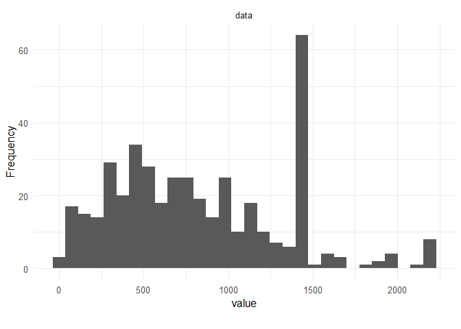

Exploratory Data Analysis
================

## Packages and Data

``` r
## Packages
library(DataExplorer)
library(ggplot2)

## Data
data_CHL <- read.csv("../data/tidy/chl_undersecretaries.csv", encoding = "UTF-8")
```

## Data Set Plot

``` r
plot_intro(data_CHL, ggtheme = theme_minimal(base_size = 12),
           theme_config = theme(legend.position = "none")) 
```

<!-- -->

## Discrete Variables

``` r
selection_var1 <- drop_columns(data_CHL, c("id", "country", "name", "start_president", "end_president",
                                           "ministry", "undersec", "start_undersec", "end_undersec"))
plot_bar(selection_var1, ggtheme = theme_minimal(base_size = 12))
```

<!-- -->

## Time Variable

``` r
data_CHL$time <- with(data_CHL, (as.Date(data_CHL$end_undersec) - as.Date(data_CHL$start_undersec)))
data_CHL$time <- as.numeric(data_CHL$time)
plot_histogram(data_CHL$time, ggtheme = theme_minimal(base_size = 12))
```

<!-- -->
